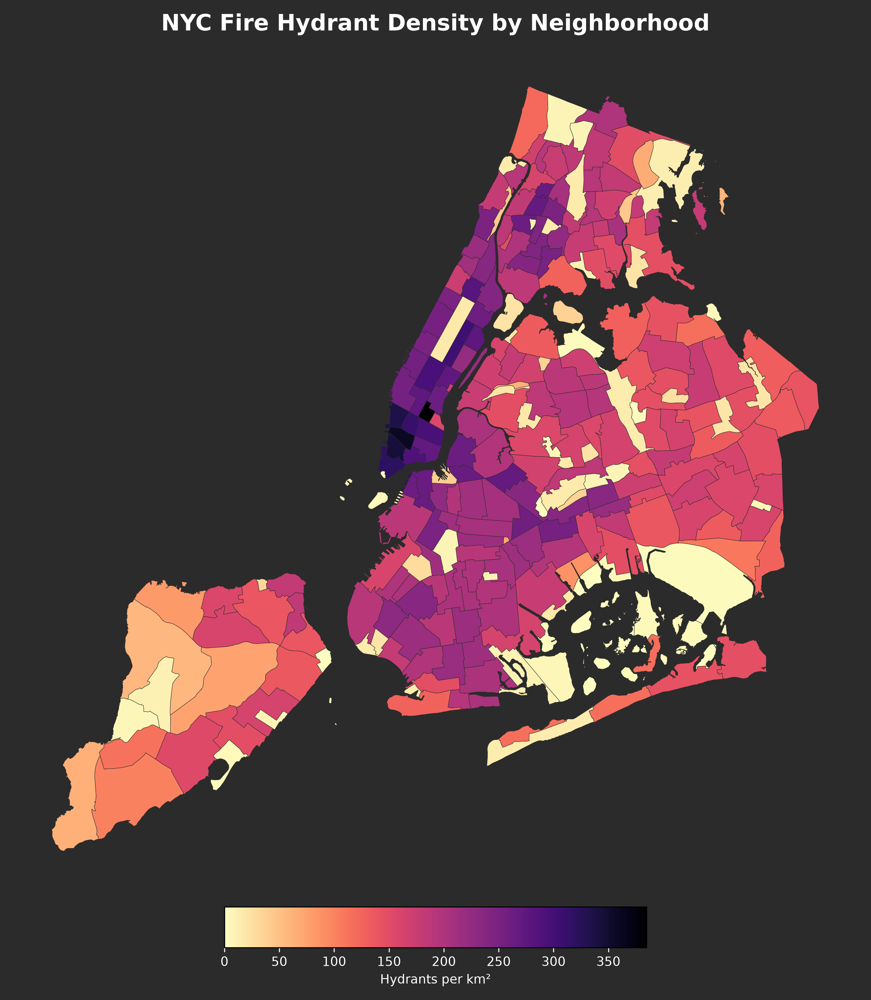
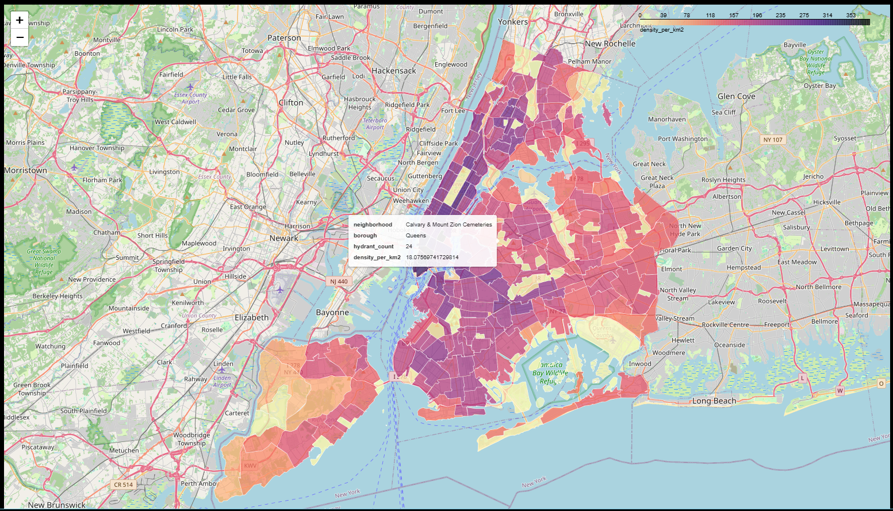

# NYC Hydrant Density Analysis

## The question

Where is hydrant coverage densest in NYC, and which neighborhoods are underserved relative to their area?

## The data

- **NYC Neighborhoods.** 262 polygons (Source: [NYC Open Data](https://opendata.cityofnewyork.us))
- **NYC Fire Hydrants.** 109,725 points (Source: [NYC Open Data](https://opendata.cityofnewyork.us))
- License: NYC Open Data Terms of Use
- All data in EPSG:4326

## Methodology

Built the same analysis twice:

- **SQL (PostGIS).** Five progressive queries in `analysis.sql`, going from simple filter to spatial join to area-normalized density to 100ft-buffer coverage analysis.
- **Python (GeoPandas).** Equivalent pipeline in `analysis.ipynb`, with a static choropleth and interactive `.explore()` map. Final output exported to GeoParquet.

Both pipelines produce the same density values to within rounding. The Python version produces the visualization. The SQL version runs against a database at scale.

## Findings

- Top 5 neighborhoods by hydrant density (per km²):
  1. Gramercy
  2. SoHo-Little Italy-Hudson Square
  3. Tribeca-Civic Center
  4. West Village
  5. Financial District-Battery Park City
- Bottom 5 neighborhoods (least coverage):
  1. Hoffman & Swinburne Islands
  2. Jamaica Bay (West)
  3. The Evergreens Cemetery
  4. Fort Wadsworth
  5. Shirley Chisholm State Park
- Median neighborhood has 165.5 hydrants per km² and 43% of its area lies is within 100ft of a hydrant.





## How to run it

Requires Docker (for PostGIS) and Python 3.11+ with GeoPandas.

```bash
git clone https://github.com/{your-username}/nyc-hydrant-analysis.git
cd nyc-hydrant-analysis

# Start the PostGIS template
docker compose -f docker/postgis/docker-compose.yml up -d

# Load NYC Open Data into PostGIS (your script of choice)
# Then run the SQL pipeline
psql -h localhost -U gisuser -d nyc -f analysis.sql

# Then the Python pipeline
jupyter lab analysis.ipynb
```

## What I learned

The progressive queries were helpful in understanding how to build out the logic beneath a research question. The parallel pipelines in two different systems facilitated a more complete understanding of when to work in a psql session within PostGIS versus writing queries in a .sql file versus GeoPandas and Python. The next time I apply these skills, I will feel more confident about which environments I need to spin up to best explore, analyze, and visualize the data.

The density results were effectively identical between SQL/PostGIS and Python/GeoPandas. Coverage percentages differed by approximately 0.2 percentage points in many neighborhoods, likely due to small differences in geometry union and intersection operations between the two processing pipelines. The ranking and overall analytical conclusions remained consistent.

The prompt for the exercise requested a 100m buffer but uses EPSG:2263 which is in US survey feet, so the provided query creates a 100 ft buffer. When I converted to a true 100 m buffer (328.08 ft), the resulting coverage percentages became essentially 100% for all neighborhoods, suggesting hydrant density in NYC is sufficient for complete coverage at that radius. 

## Stack

- PostGIS 16-3.4 (via Docker)
- GeoPandas + SQLAlchemy + matplotlib
- Jupyter Lab
- GeoParquet
